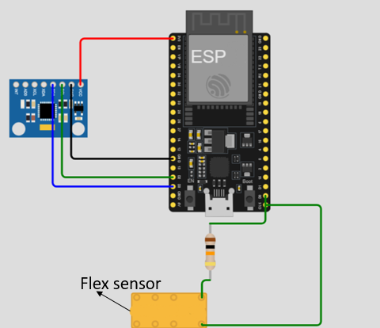
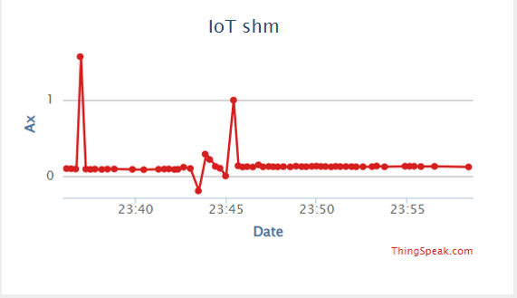
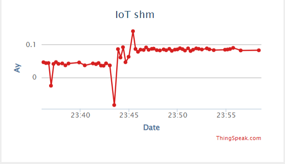
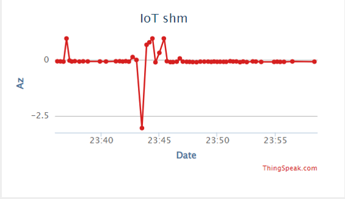
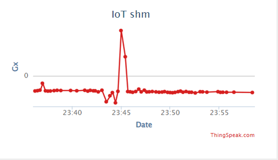
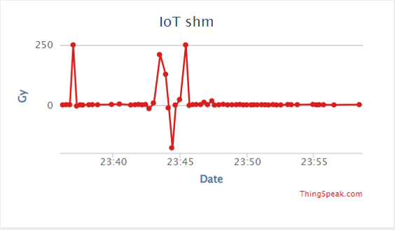
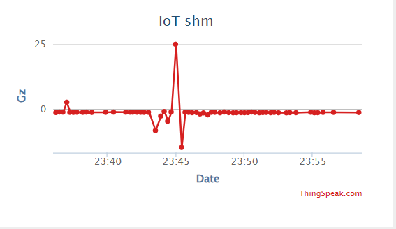

# RealtimeAccelerationData
# ESP8266 Acceleration and Deflection Data 

This project collects acceleration and deflection data using the ThingSpeak IoT platform. It employs an ESP8266 microcontroller, an MPU6050 accelerometer and gyroscope, and a flex sensor with a suitable resistor.

## Components Used

- **ESP8266**: Microcontroller for Wi-Fi connectivity.
- **MPU6050**: 6-axis motion tracking sensor (3-axis gyroscope and 3-axis accelerometer).
- **Flex Sensor**: Measures bending and deflection.
- **Resistor**: Used in conjunction with the flex sensor.

## Circuit Diagram

## Output Graphs

Here are examples of the output graphs from ThingSpeak showing acceleration and rotational velocity

## Features

- Real-time data collection and transmission to the ThingSpeak platform.
- Visualize acceleration and deflection data online.
- Simple setup and integration for easy deployment.

## Installation

### Requirements

- **Arduino IDE**: Version 1.8.15 or later.
- **ESP8266 Board Package**: Make sure to install the ESP8266 board package via the Arduino IDE's Board Manager.
- **Libraries**: You will need the following libraries:
  - `Wire.h`
  - `MPU6050.h`
  - `WiFi.h`
  - `ThingSpeak.h`

### Steps to Install

1. Clone or Download the repo
2. Make changes in code wherever it is commented.

